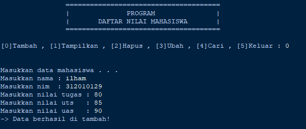

# UAS

Untuk memenuhi nilai UAS

- Nama  : Ilham Nur Utomo
- NIM   : 312010129
- Kelas : TI.20.A.1
- Matakuliah  : Bahasa Pemrograman

## Soal


**Struktur Package & Module**


* Terdapat 2 package dengan nama model dan view
* Package model berisi module tambah_data, ubah_data, hapus_data dan cari_data
* Package view berisi module cetak_daftar_nilai dan cetak_hasil_pencarian
* main.py sebagai menu, program yang pertama kali dieksekusi.

**Penjelasan:**

**Model**

Tambah data
* deklarasikan fungsi ``def tambah_data():``
* ``nama = input("Masukan nama: ")`` lalu tambahkan input nama, nim, nilai tugas, uts, uas
* ``nilai_akhir = int(nilai_tugas)*30/100 + int(nilai_uts)*35/100 + int(nilai_uas)*35/100 `` untuk nilai akhir diambil dari perhitungan 3 komponen nilai (nilai_tugas: 30%, nilai_uts: 35%, nilai_uas: 35%)
* ``mahasiswa[nama] = [nama, nim, nilai_tugas, nilai_uts, nilai_uas, nilai_akhir]`` kita akan masukkan data yang tadi kita input ke dalam `mahasiswa[nama]'
* lalu cetak ``print()``


Ubah data
* deklarasikan fungsi ``def ubah_data():``
* ``nama = input("Masukan nama untuk mengubah data: ")`` kita akan menginput data yang nanti akan di ubah
* ``if nama in mahasiswa.keys(): print("Mau mengubah apa?")`` jika 'nama' dari di dalam 'mahasiswa' maka akan mengembalikan daftar menggunakan fungsi 'keys()' lalu di cetak lah 'print()'
* ``tanya = input("(Semua), (Nama), (NIM), (Tugas), (UTS), (UAS) : ")`` membuat menu ubah di dalam ``tanya``
* lalu cetak ``print("\nBerhasil ubah data!")``
* Jika kita ingin mengubah data tertentu maka ``elif tanya.lower() == "nim": mahasiswa[nama][1] = input("NIM:")`` dan berlaku juga untuk nilai tugas, UTS dan UAS
* lalu cetak ``print("\nBerhasil ubah data!")``
* ``else: print("'{}' tidak ditemukan.".format(nama))`` jika kita salah dalam memasukkan nama untuk mengubah data maka akan muncul 'nama tidak di temukan'


Cari data
* deklarasikan fungsi ``def cari_data():``
* ``nama = input("Masukan nama untuk mencari data: ")`` kita akan menginput data yang nanti akan di cari
* ``if nama in data.keys():`` kita mengambil list 'nama' di dalam 'mahasiswa' menggunakan pengkondisian
* maka cetak ``print("Nama: {0}\nNIM : {1}\nNilai Tugas: {2}\nUTS: {3}\nUAS: {4}\nNilai akhir: {5}"`` untuk menampilkan data yang tersedia
* ``else: print("'{}' tidak ditemukan.".format(nama))`` jika data yang kita input salah/tidak ditemukan maka akan tercetak 'nama tidak di temukan'

Hapus data
* deklarasikan fungsi ``def hapus_data():``
* ``nama = input("Masukan nama untuk menghapus data : ")`` kita akan menginput data yang nanti akan di hapus
* ``if nama in mahasiswa.keys():`` kita mengambil list 'nama' di dalam 'data' menggunakan pengkondisian
* ``del mahasiswa[nama]`` hapus semua 'nama'  yang ada di dalam 'mahasiswa'
* jika sudah maka cetak ``print("tanya '{}' berhasil dihapus.".format(nama))``
* ``else: print("'{}' tidak ditemukan.".format(nama))`` jika data yang kita input salah/tidak ditemukan maka akan tercetak 'nama tidak di temukan'

**View**

Lihat data
* deklarasikan fungsi ``def lihat_data():`` Kita menggunakan kondisi percabangan if, ambil data dari ``mahasiswa``
* lalu cetak ``print()``

Lalu yang terakhir kita eksekusi file main.py
```
import os, platform
from model.daftar_nilai import *
from view.input_nilai import *
from view.view_nilai import *


if(platform.system() == 'Windows'):
    os.system('cls')
else:
    os.system('clear')

while(True):

    print(" "*15,"======================================")
    print(" "*15,'|              PROGRAM               |')
    print(" "*15,'|       DAFTAR NILAI MAHASISWA       |')
    print(" "*15,"======================================")
    tanya = int(input("\n[0]Tambah , [1]Tampilkan , [2]Hapus , [3]Ubah , [4]Cari , [5]Keluar : "))
    print("\n")

    if(tanya == 0):
        tambah_data()

    elif(tanya == 1):
        cetak_daftar_nilai()

    elif(tanya == 2):
        hapus_data()

    elif(tanya == 3):
        ubah_data()

    elif(tanya == 4):
        cari_data()

    elif(tanya == 5):
        break

    else:
        print("Keyword yang anda masukkan salah ...")

    print("\n")

```

**Output:**

- Tambah data

  


- Ubah data

  


- Lihat data

  


- Cari data

  


- Hapus data

  
